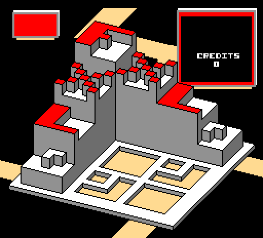

# Chill65

A static recompiler toolchain for Atari 6502 arcade games, translating the
original assembly source into Rust for native and WebAssembly targets.

First target: **Crystal Castles** (Atari, 1983).



*Attract mode at frame 600 — assembled from the original 1983 MACRO-11 source by
`chill65-asm`, executed by `chill65-runtime`, and coloured through the board's
own colour RAM. No game code or ROMs are distributed here; see below.*

## Status

**Phases 0, 1, 2 and 3 complete and gated.**

**Phase 1 — the assembler.** `chill65-asm` reassembles the original Atari source
to output byte-identical with the original toolchain's own: 24,576 bytes of
program and 16,384 of castle data, both exact.

```
CHILL65_CORPUS=/path/to/crystal-castles \
  cargo test -p chill65-asm --test gate -- --ignored --nocapture
```

**Phase 2 — the runtime.** `chill65-runtime` is a 6502 interpreter and a model
of the Crystal Castles board: bus, ROM banking, the bitmap coordinate window,
colour RAM, frame timing, two POKEYs with a real poly17/poly9 LFSR, switches and
trackball. It boots the images the assembler produces and runs the game.

Two independent checks say it is right:

- **Klaus Dormann's 6502 test suite** — 45 million instructions, including full
  NMOS decimal-mode flag semantics.
- **The game's own ROM self-test**, which passes on all five devices across both
  banks (`checksums [1, 2, 3, 4, 5]`) and provably fails on a single corrupted
  byte. That diagnostic was written by Atari, not by us, which is what makes it
  worth passing.

```
CHILL65_CORPUS=/path/to/crystal-castles \
  cargo test -p chill65-runtime -- --ignored --nocapture
```

`ccrun` runs the machine headless and dumps the picture as a PPM:

```
cargo run -p chill65-runtime --bin ccrun -- prog.bin data.bin \
  --frames 600 --dump attract.ppm
```

Attract mode is deterministic — identical frame hash across independent runs,
which Phase 3's differential harness depends on.

**Phase 3 — the differential harness.** `chill65-diff` drives our runtime and
two independent external implementations from identical recorded input, and
reports where they first disagree and which routine drew the difference.

```
CHILL65_CORPUS=/path/to/crystal-castles \
  cargo test -p chill65-diff -- --ignored --nocapture
```

It is gated on the machinery working, not on agreement — divergence against an
external oracle is the output, since six hardware claims remain unverified and
motion objects are unmodelled. Given a fault injected in a known place, it finds
the frame and names the routine, twice running:

```
clean vs clean:  identical over 600 frames
clean vs faulty: diverged at frame 419: LN.F1 [CRF.MAC] (85 pixels), ...
```

Both external oracles run for real. MAME 0.276 boots a `ccastles3` ROM set
**rebuilt entirely from the game source** — all eleven devices matching MAME's
own CRC-32, confirmed by `mame -verifyroms`, with nothing downloaded — and the
MiSTer FPGA core is verilated unmodified as a second reference.

Its first finding is that our colour RAM powers on white where both oracles power
on black; see `gate3.md`.

Windowing and audio are deliberately out of scope; the core stays headless and
dependency-free.

See `atari-recompiler-plan.md` for the full plan, and:

| Document | What it establishes |
|---|---|
| `smc-gate.md` | No self-modifying code, no computed control transfers (plan Phase 0.1) |
| `integrity.md` | Which source version to build, verified against 13 documented ROM checksums (Phase 0.2) |
| `inventory.md` | The archive: ~20 Atari coin-op titles, in two dialect generations (Phase 0.3) |
| `data.md` | Castle/wave data format (Phase 0.4) |
| `hardware.md` | **The Phase 2 deliverable.** The board as modelled: memory map, ROM banking, latches, video, timing, POKEY, inputs — 75 `file:line` citations, with unverified claims marked as such |
| `frontend.md` | Why the front end is written in Rust rather than reusing AT6502 |
| `gate1.md` | The Phase 1 gate: both images byte-identical, and the causes that closed the last 1,696 bytes |
| `dialect.md` | The assembler dialect as implemented, and what is deliberately not |
| `codegen-readiness.md` | Open question O3 measured: 64.4% structured control flow |
| `gate2.md` | The Phase 2 gate: Phase 1 unregressed, the game's own self-test passing, attract mode deterministic |
| `harness.md` | **The Phase 3 deliverable.** The harness: trace format, oracle seam, routine attribution, the ROM-set reconstruction, and both external oracles |
| `gate3.md` | The Phase 3 gate: fault injection localised to its frame and routine, and what the harness found |
| `LOOP.md` | Working scope and stop conditions |

## You must supply your own game source

This repository contains **no game code and no ROMs**, and never will. The
`historicalsource` material is archived donated material, not a licensed
release, and Atari is an active rights holder. The toolchain, runtime and
hardware models here are original work; emitted game code is not distributable.

This is the same posture the MiSTer FPGA core takes — ship the implementation,
require the user to provide the game.

To work on the toolchain you will want local clones of the reference material.
All are excluded by `.gitignore`:

```
git clone https://github.com/historicalsource/crystal-castles
git clone https://github.com/historicalsource/atari-coin-op-assembler
git clone https://github.com/MiSTer-devel/Arcade-CrystalCastles_MiSTer
```

## Layout

```
crates/chill65-asm/       assembler front end for the Atari MACRO-11 dialect
crates/chill65-runtime/   6502 interpreter and Crystal Castles machine model
crates/chill65-diff/      differential harness: traces, oracles, divergence localisation
traces/                   recorded input traces (our own work, not game-derived)
tools/                    Python analysis scripts (LDA decoder, source scanners)
```

## Build

```
cargo check
cargo test
```

No third-party crate dependencies.
